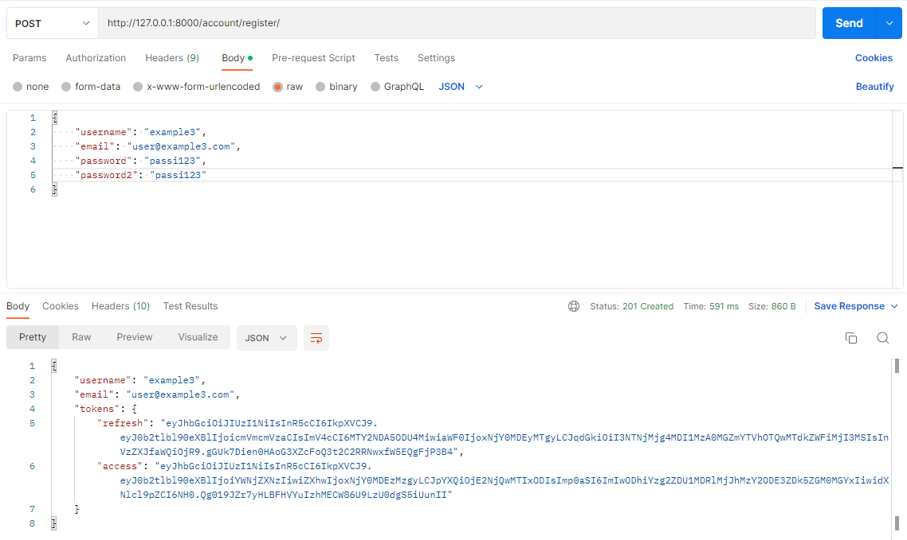
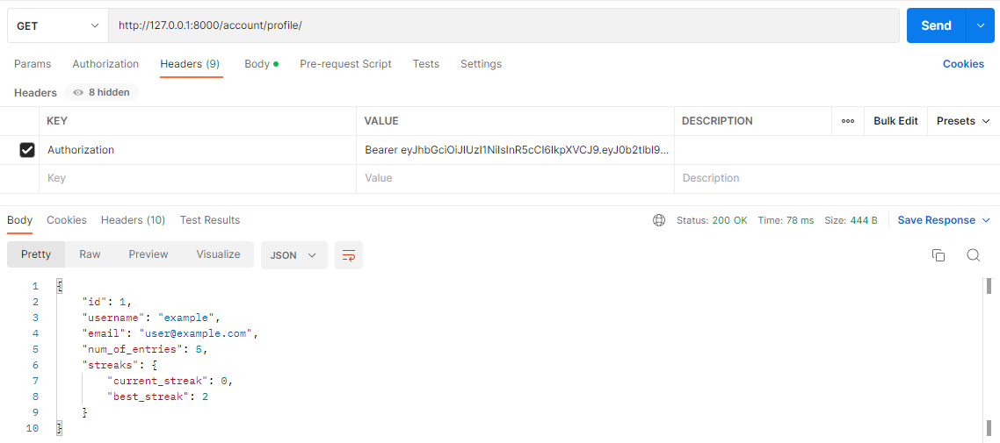
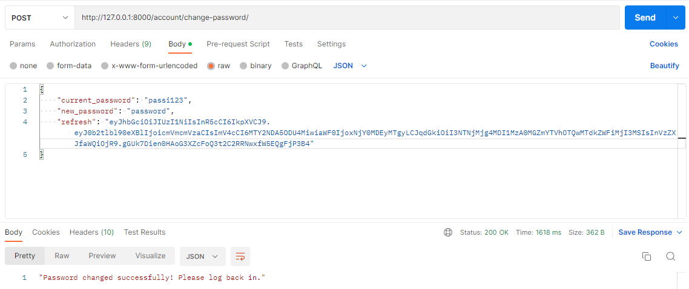
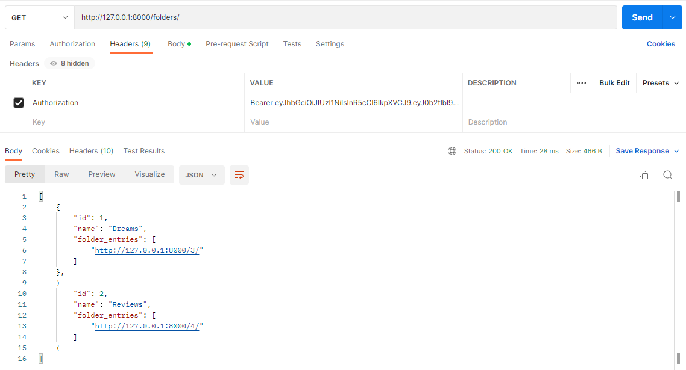

# Diary API
> REST API to store and keep track of diary/journal entries, folders, tags, and posting streaks.


## API endpoints
<sub>*Uses JWT authentication.  
Methods in italic are accessible without authentication.  
Methods in bold are only accessible by admins.  
All other methods are only accessible by logged in users.*</sub>

### User endpoints 
`http://localhost:5000/account/`
| Endpoint  | HTTP methods | Description |
| --- | --- | --- |
| `register/` | *`POST`* |
| `change-password/` | `POST` | Updates password & blacklists current refresh token |
| `token-refresh/` | `POST` |
| `login/` | *`POST`* | Enter username & password to log in |
| `logout/` | `POST` | Blacklists current refresh token |
| `profile/` | `GET` | Get logged-in user's profile |
| `profiles/` | **`GET`** | Get all registered profiles |
| `profiles/<int:pk>/` | **`GET`** |

### Quotes endpoints
`http://localhost:5000/`
| Endpoint  | HTTP methods | Description |
| --- | --- | --- |
| ` ` | `GET` `POST` | Get list of diary entries |
| `<pk>/` | `GET` `PUT` `PATCH` `DELETE` |
| `pinned/` | `GET` | Get list of pinned entries (`pinned` attribute is write only) |
| `pinned/<int:pk>/` | `GET` `PUT` `PATCH` `DELETE` |
| `trash/` | `GET` | Get list of trashed entries (`deleted` attribute is write only) (entries older than 30 days are deleted) |
| `trash/<int:pk>/` | `GET` `PUT` `PATCH` `DELETE` |
| `folders/` | `GET` `POST`| Get list of folders (folder names are unique per user) |
| `folders/<int:pk>/` | `GET` `PUT` `PATCH` `DELETE` |
| `tags/` | `GET` `POST` | Get list of tags (tag names are unique per user) |
| `tags/<int:pk>/` | `GET` `PUT` `PATCH` `DELETE` |

## Usage
- **Register**


- **Get profile**


- **Change password**


- **Get all registered user profiles**


- **Get all entries**


- **Create entry**


- **Get all folders**


- **Get all tags**


## Installation
1. **Clone the repo**
```
git clone https://github.com/stealacamera/diary-api.git
```
2. **Create and activate a virtual environment**
```
virtualenv <venv name>
<venv name>\Scripts\activate
```
3. **Install the dependencies**
```
pip install -r requirements.txt
```
4. **Run migrations and server**
```
python manage.py migrate
python manage.py runserver
```
